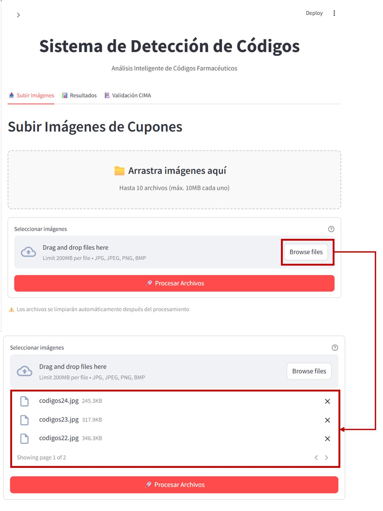
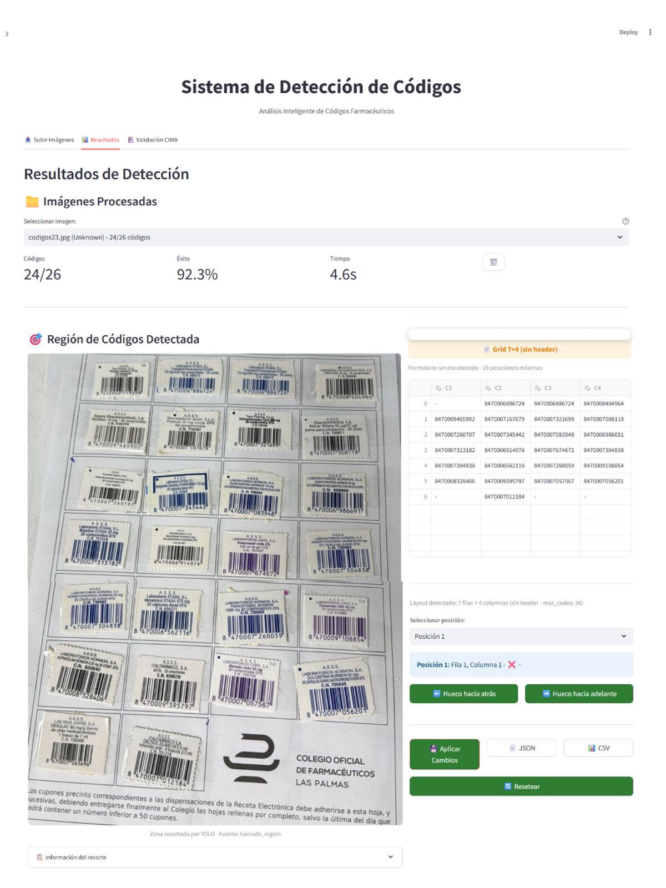
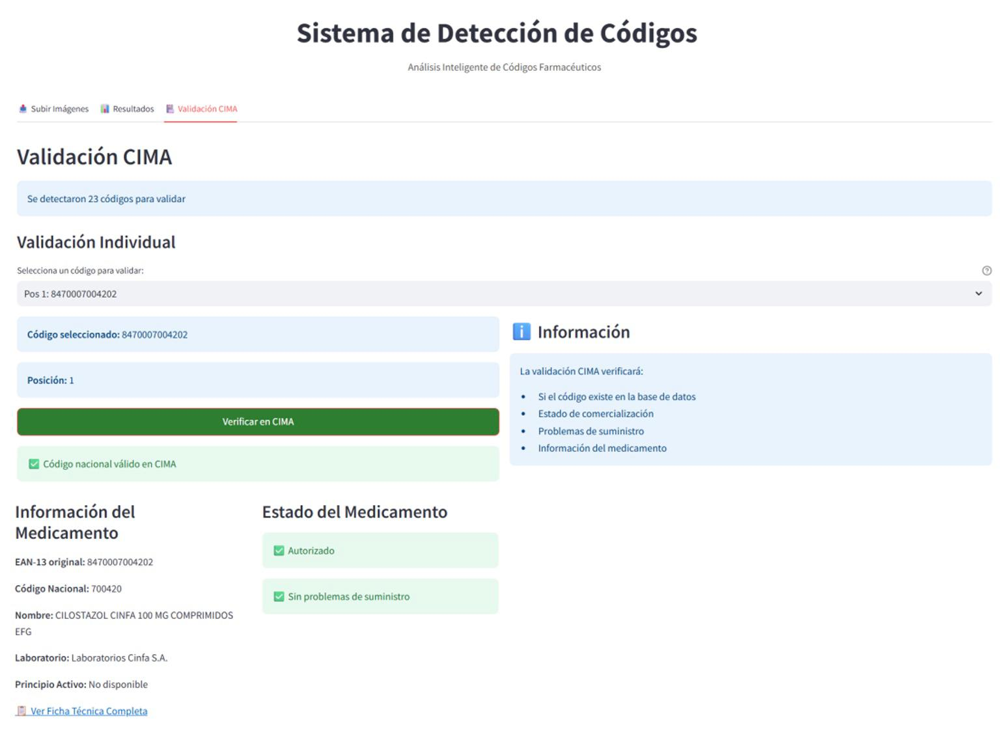

# Procesamiento Automático de Cupones Precinto de Farmacia

_Un sistema de Visión por Computador para la digitalización y análisis de hojas de cupones precinto del Sistema Nacional de Salud español._

Este repositorio contiene el código fuente y los resultados del Trabajo Fin de Grado (TFG) "Procesamiento automático de cupones precinto de farmacia por medio de técnicas de aprendizaje profundo", desarrollado por Andrea Mayor Gómez.

## Índice

- [Visión General del Proyecto](#visión-general-del-proyecto)
- [Características Principales](#características-principales)
- [El Enfoque Híbrido: La Clave del Éxito](#el-enfoque-híbrido-la-clave-del-éxito)
- [Estructura del Repositorio](#estructura-del-repositorio)
- [Instalación](#instalación)
- [Uso](#uso)
- [Interfaz De Usuario](#interfaz-de-usuario)
- [Resultados Experimentales](#resultados-experimentales)
- [Licencia](#licencia)

## Visión General del Proyecto

La gestión de cupones precinto en las farmacias españolas es un proceso manual, lento y susceptible a errores que representa uno de los últimos obstáculos para la digitalización completa del sector. Este proyecto aborda este problema desarrollando una solución integral que automatiza la detección, extracción y validación de los códigos de barras de las hojas de cupones.

Se investigaron y compararon múltiples enfoques tecnológicos:
1.  **Redes Neuronales:** Modelos como YOLOv10.
2.  **Procesamiento Clásico de Imágenes:** Un detector basado en análisis de gradientes.
3.  **Modelos Fundacionales (APIs):** GPT-4 Vision y Google Gemini.
4.  **Segmentación Universal:** SAM2.

La solución final es una **aplicación web interactiva** construida con Streamlit que implementa un **sistema híbrido**, combinando las fortalezas de YOLO y el análisis de gradientes para alcanzar una precisión y robustez superiores a cualquier método individual.

## Características Principales

-   **Sistema de Detección Híbrido:** Combina YOLO para el análisis de layout y el detector de gradientes para una localización precisa de códigos, logrando una **precisión media del 85%**.
-   **Corrección Posicional Avanzada:** Un algoritmo (`GridPositionCorrector`) que garantiza que cada código de barras se asigne a su celda correcta en la cuadrícula, incluso con detecciones parciales.
-   **Análisis Comparativo Exhaustivo:** El repositorio incluye los scripts y resultados de la evaluación de todos los métodos probados.
-   **Validación Regulatoria:** Integración con la API de **CIMA** (Centro de Información de Medicamentos de la AEMPS) para verificar la validez de los códigos extraídos.
-   **Interfaz Web Intuitiva:** Una aplicación desarrollada con Streamlit que permite la carga de imágenes por lotes, la visualización de resultados y la edición manual de forma sencilla.

## El Enfoque Híbrido: La Clave del Éxito

Los experimentos demostraron que ningún método individual era perfecto. La solución óptima fue un **orquestador inteligente** que combina lo mejor de dos mundos:

1.  **Fase 1 (Análisis de Layout con YOLO):** Se utiliza YOLO para un análisis rápido de la imagen completa. Su principal función es detectar si existe una cabecera (`header`) manuscrita y localizar el área general (`barcode`) donde se encuentra la matriz de cupones. Esto determina si la cuadrícula es de 6x4 o 7x4.
2.  **Fase 2 (Detección Precisa con Gradientes):** El detector de gradientes, que es más lento pero muy preciso localizando las barras verticales, se aplica únicamente sobre el área de interés recortada por YOLO. Esto enfoca su potencia computacional y evita falsos positivos.
3.  **Fase 3 (Orquestación y Corrección):** El `Orchestrator` y el `GridPositionCorrector` fusionan los resultados, aplican la lógica de corrección posicional y ensamblan la cuadrícula final de códigos decodificados.

Este enfoque híbrido (implementado en `farmcode_detector.py`) demostró ser significativamente superior, alcanzando una precisión media del **85.0%**, frente al 64.8% de YOLO por sí solo y el 53.7% del detector de gradientes.

## Estructura del Repositorio

-   `pharmaceutical-barcode-scanner/`
    -   `README.md`
    -   `farmcode_detector/`
        -   `streamlit_app.py`
        -   `requirements.txt`
        -   `core/`
        -   `components/`
    -   `data/`
    -   `datasets/`
    -   `runs/`
    -   `sam2/`
    -   `pruebas/`

## Instalación

Para ejecutar la aplicación principal y los scripts de prueba, sigue estos pasos:

1.  **Prerrequisitos:**
    -   Git
    -   Python 3.9 o superior
    -   Un gestor de entornos virtuales como `venv` o `conda`.

2.  **Clonar el repositorio:**
    ```
    git clone https://github.com/tu-usuario/pharmaceutical-barcode-scanner.git
    cd pharmaceutical-barcode-scanner
    ```

3.  **Crear y activar un entorno virtual:**
    ```
    python -m venv venv
    source venv/bin/activate  # En Windows: venv\Scripts\activate
    ```

4.  **Instalar dependencias del sistema (para sistemas basados en Debian/Ubuntu):**
    ```
    sudo apt-get update
    sudo apt-get install -y $(cat farmcode_detector/packages.txt)
    ```

5.  **Instalar dependencias de Python:**
    ```
    pip install -r farmcode_detector/requirements.txt
    ```

## Uso

### 🚀 Accede a la Aplicación Web

**[➡️ Haz clic aquí para probar la aplicación en vivo](https://pharmaceutical-barcode-scanner-dcw2nuusw84klfm7uc9znp.streamlit.app/)**

### Ejecutar la Aplicación en Local

La aplicación principal implementa el sistema híbrido y ofrece una interfaz gráfica completa para ejecutarla en tu propio ordenador.

```
cd farmcode_detector/
streamlit run streamlit_app.py
```

Navega a la URL local que se muestra en la terminal (normalmente `http://localhost:8501`) para empezar a procesar imágenes de cupones.

### Interfaz de Usuario

La aplicación web guía al usuario a través de un flujo intuitivo de tres secciones principales, diseñadas específicamente para usuarios farmacéuticos sin conocimientos técnicos avanzados.

#### 1. Carga y Validación de Imágenes


*Figura 1: Sección de carga con interfaz drag-and-drop y validación automática*

**Características principales:**
- **Carga por lotes**: Procesa hasta 10 imágenes simultáneamente
- **Validación automática**: Verifica formato, resolución y calidad de imagen
- **Formatos soportados**: JPEG, PNG, TIFF
- **Límite de archivo**: Máximo 10MB por imagen
- **Resolución mínima**: 300×300 píxeles para garantizar detección precisa

**Validaciones implementadas:**
- Verificación de integridad de archivos
- Análisis automático de contraste y nitidez
- Recomendaciones para mejorar calidad de captura

#### 2. Visualización y Edición de Resultados

  
*Figura 2: Panel principal con visualización de detecciones y editor interactivo*

**Panel de visualización:**
- **Superposiciones gráficas**: Rectángulos numerados según posición en cuadrícula
- **Código de colores**: Verde para códigos detectados, rojo para posiciones faltantes
- **Zoom interactivo**: Inspección detallada de cada código detectado
- **Indicadores de confianza**: Certeza del algoritmo sobre cada detección

**Editor de códigos:**
- **Tabla adaptativa**: Se ajusta automáticamente al layout detectado (6 o 7 filas)
- **Edición en tiempo real**: Corrección manual de códigos problemáticos
- **Validación de formato**: Previene códigos EAN-13 incorrectos
- **Gestión de huecos**: Botones para ajustar secuencia de códigos

#### 3. Validación Regulatoria con CIMA


*Figura 3: Integración con base de datos oficial CIMA para verificación regulatoria*

**Funcionalidades de validación:**
- **Identificación automática**: Reconoce códigos farmacéuticos españoles
- **Consulta oficial**: Conecta con base de datos CIMA del Ministerio de Sanidad
- **Información detallada**: Denominación comercial, laboratorio, principio activo
- **Estado de comercialización**: Verificación de validez regulatoria


### Ejecutar los Scripts de Prueba

Los scripts en la carpeta `pruebas/` permiten ejecutar cada detector de forma individual. Son útiles para reproducir los resultados experimentales.


*Consulta cada script para ver sus argumentos específicos.*

## Resultados Experimentales

La evaluación comparativa de los métodos arrojó los siguientes resultados clave. Gemini demostró la mayor precisión, pero con una latencia y dependencia de API significativas. El sistema híbrido (`FarmCode`) ofrece el mejor equilibrio entre rendimiento, velocidad y autonomía.

| Métrica                   | **FarmCode (Híbrido)** | YOLOv10 (Local) | Gradientes (Local) | Gemini (API) | GPT-4 Vision (API) |
| ------------------------- | :--------------------: | :-------------: | :----------------: | :----------: | :----------------: |
| **Precisión Media**       |       **85.0%**        |      64.8%      |       53.7%        |  **98.3%**   |       24.7%        |
| **Tiempo de Proc. (s)**   |       **~3.5s**        |      ~3.0s      |       ~1.5s        |     ~9.5s    |       ~6.6s        |
| **Dependencia Externa**   |           No           |       No        |         No         |      Sí      |         Sí         |
| **Escenario Recomendado** |    **Producción**      |   Base Rápida   |      Respaldo      | Alta Precisión |  No Recomendado    |

*Los resultados detallados, imagen por imagen, se encuentran en `data/comparison/`.*

## Licencia

Este proyecto está distribuido bajo la Licencia MIT.
